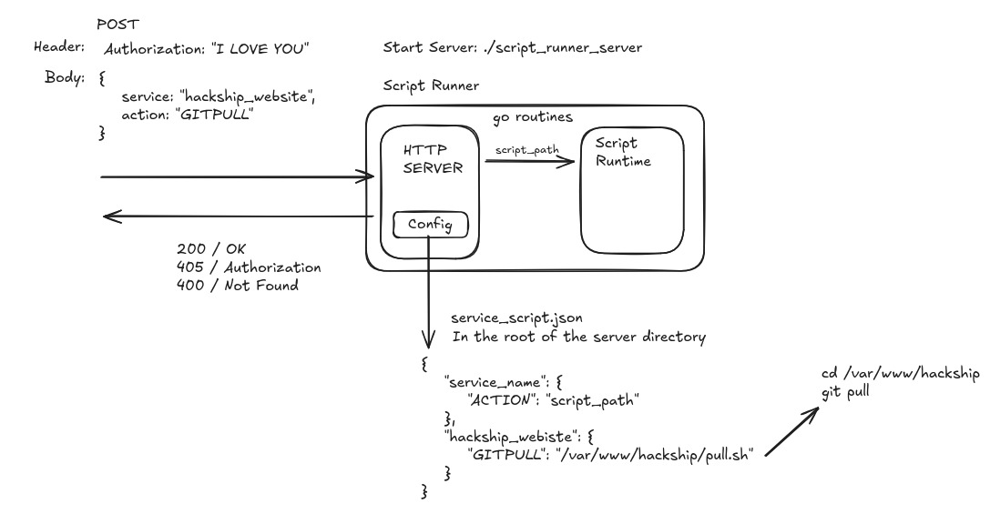

# Hackship Automation Server for Infrastructure

A request-driven server that executes automation scripts for infrastructure operations.

## Technologies
- GoLang

## Project Structure
```project_structure
hackship-automation-server/
├── docs/
│   └──                # Documentation, diagrams, notes
├── config.json        # Service → action → script mapping
├── main.go            # Application entry point (HTTP server + runtime)
├── README.md          # Project documentation

```

## Components
- `Script Engine`

- `Embedded HTTP Server` – Handles incoming (POST) HTTP requests

- `Script Runtime Environment` – Executes and manages scripts

- `config.json` (Root Dir of Server)

### Config.json
---
```json
{
  "service_name": {
    "action": "script_path"
  }
},

`for e.g.,`

{
  "hackship_offical_website": {
    "gitpull": "/dir/var/www/pull.sh"
  }
}

```
### HLD
---



